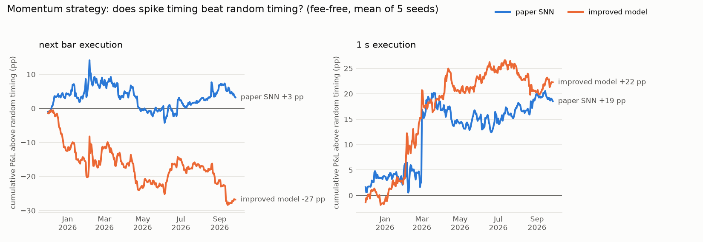

# Head-to-head strategy backtests: paper SNN vs improved model

The paper's three strategies (§7), each driven once by the paper SNN (E1 settings) and once by the
improved model (E2 settings), both tuned on the validation period only. Identical test days
(2025-12-01 → 2026-09-26, 300 days), seeds 0–4, 100 aggTrades per bar, fee-free (U3). Every trade
goes through the `Strategy` class (§7.3) with the model's cached signals. Each model's random-timing
benchmark fires as often as that model, so "above random timing" isolates the value of the timing.

```bash
.venv/bin/python -m experiments.run_experiment --config experiments/configs/head_to_head.yaml
.venv/bin/python -m experiments.head_to_head_report --results results/head_to_head --out docs/reports/head_to_head.md
```

## Spikes

| Model | Spike accuracy | Random timing | Big-move (same rate) | Signals per day |
|---|---|---|---|---|
| paper SNN | 57.39 % | 51.76 % | 61.28 % | 1,418 |
| improved model | 58.57 % | 51.73 % | 60.00 % | 2,614 |

## Strategy performance

Accumulated returns add up trades of notional 1, so they grow with the number of trades (the
improved model trades about twice as often); per-trade return (bp) and Sharpe compare better.

| Strategy | Execution | paper SNN: return | paper SNN: Sharpe (random) | paper SNN: win rate | paper SNN: bp/trade | improved model: return | improved model: Sharpe (random) | improved model: win rate | improved model: bp/trade |
|---|---|---|---|---|---|---|---|---|---|
| Momentum | next bar | 279 % | 8.64 (9.88) | 51.46 % | 0.066 | 518 % | 8.68 (9.69) | 51.35 % | 0.066 |
| Momentum | 10 ms | 100 % | 3.86 (3.94) | 50.76 % | 0.024 | 217 % | 5.09 (4.98) | 50.77 % | 0.028 |
| Momentum | 100 ms | 52 % | 1.78 (2.54) | 50.59 % | 0.012 | 152 % | 3.67 (3.59) | 50.65 % | 0.019 |
| Momentum | 1 s | 44 % | 1.61 (1.24) | 50.48 % | 0.010 | 86 % | 2.54 (1.91) | 50.52 % | 0.011 |
| Alexander's filter | next bar | 296 % | 9.38 (11.45) | 51.49 % | 0.070 | 602 % | 10.13 (10.88) | 51.38 % | 0.077 |
| Alexander's filter | 10 ms | 100 % | 3.89 (4.21) | 50.72 % | 0.023 | 223 % | 5.86 (5.56) | 50.72 % | 0.028 |
| Alexander's filter | 100 ms | 52 % | 1.75 (2.58) | 50.56 % | 0.012 | 155 % | 4.17 (3.76) | 50.59 % | 0.020 |
| Alexander's filter | 1 s | 37 % | 1.41 (0.97) | 50.46 % | 0.009 | 71 % | 2.24 (1.84) | 50.45 % | 0.009 |
| Stochastic oscillator | next bar | 290 % | 8.99 (10.62) | 51.50 % | 0.068 | 568 % | 9.15 (10.11) | 51.38 % | 0.072 |
| Stochastic oscillator | 10 ms | 103 % | 3.97 (4.12) | 50.75 % | 0.024 | 222 % | 5.31 (5.24) | 50.76 % | 0.028 |
| Stochastic oscillator | 100 ms | 54 % | 1.76 (2.59) | 50.59 % | 0.013 | 160 % | 3.85 (3.66) | 50.64 % | 0.020 |
| Stochastic oscillator | 1 s | 41 % | 1.54 (1.02) | 50.48 % | 0.010 | 69 % | 2.10 (1.84) | 50.48 % | 0.009 |

## Does the timing add value? (paired over the 300 test days)

| Strategy | Execution | paper SNN − random: days ahead, p | improved − random: days ahead, p | improved − paper SNN (P&L/day) | days improved ahead, p |
|---|---|---|---|---|---|
| Momentum | next bar | 159/300, 0.76 | 131/300, 0.036 | +0.797 pp | 179/300, 3.4e-07 |
| Momentum | 10 ms | 152/300, 0.4 | 164/300, 0.12 | +0.390 pp | 179/300, 0.00023 |
| Momentum | 100 ms | 145/300, 0.88 | 151/300, 0.36 | +0.332 pp | 171/300, 0.0043 |
| Momentum | 1 s | 153/300, 0.54 | 155/300, 0.15 | +0.140 pp | 167/300, 0.11 |
| Alexander's filter | next bar | 147/300, 0.38 | 134/300, 0.13 | +1.020 pp | 206/300, 1.1e-14 |
| Alexander's filter | 10 ms | 148/300, 0.68 | 150/300, 0.17 | +0.411 pp | 187/300, 1.9e-05 |
| Alexander's filter | 100 ms | 149/300, 0.85 | 152/300, 0.33 | +0.344 pp | 172/300, 0.00095 |
| Alexander's filter | 1 s | 155/300, 0.43 | 154/300, 0.35 | +0.113 pp | 158/300, 0.26 |
| Stochastic oscillator | next bar | 152/300, 0.71 | 129/300, 0.04 | +0.926 pp | 191/300, 1.1e-10 |
| Stochastic oscillator | 10 ms | 156/300, 0.43 | 146/300, 0.41 | +0.398 pp | 168/300, 0.0016 |
| Stochastic oscillator | 100 ms | 144/300, 0.98 | 145/300, 0.65 | +0.353 pp | 161/300, 0.0087 |
| Stochastic oscillator | 1 s | 148/300, 0.72 | 152/300, 0.73 | +0.096 pp | 153/300, 0.46 |



## Reading

- **Improved vs paper SNN.** The improved model's strategies earn more per day than the paper
  SNN's for every rule with next-bar, 10 ms and 100 ms execution (paired Wilcoxon p ≤ 0.009; not
  significant at 1 s), and have a higher Sharpe ratio at every latency. Most of the extra P&L comes
  from trading about twice as often: per trade they earn the same with next-bar execution
  (0.066–0.077 bp) and somewhat more with latency (e.g. 0.019–0.020 vs 0.012–0.013 bp at 100 ms).
- **Spike timing vs random timing.** Neither model makes the strategies more profitable than
  random timing with the same number of trades. The paper SNN is never significantly different;
  the improved model is slightly behind with next-bar execution (ahead on 129–134 of 300 days,
  p ≈ 0.04–0.13) and level with latency.
- **Costs.** Both earn well under 0.1 bp per trade against a taker round trip of about 10 bp.
