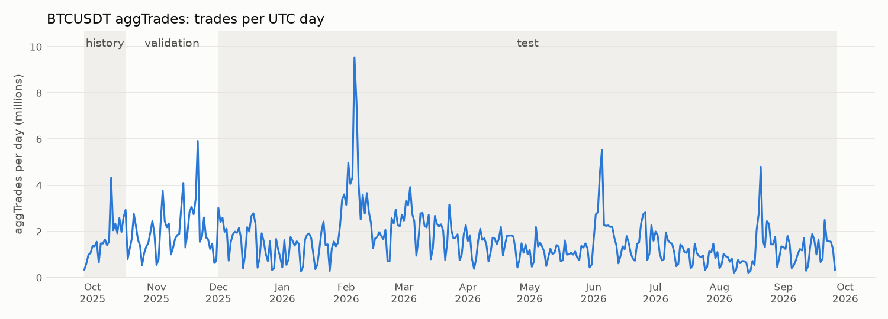

# M1 data coverage — BTCUSDT aggTrades

Source: Binance public archive (USDⓈ-M futures), every file verified against its `.CHECKSUM`.  
Range 2025-09-27 → 2026-09-26: **365/365 days cached**, 602M trades, 3.9 GB parquet.  
Bars at `vwap_num = 10`; simulation ticks at `T = 10` per bar.

| Period | Days | Trades per day, median (min – max) | Bars per day | Ticks per day (millions) |
|---|---|---|---|---|
| history | 20 | 1,519,642 (343,021 – 4,324,091) | 151,964 (34,302 – 432,409) | 1.52 (0.34 – 4.32) |
| validation | 45 | 1,750,129 (532,599 – 5,921,524) | 175,012 (53,259 – 592,152) | 1.75 (0.53 – 5.92) |
| test | 300 | 1,450,556 (204,161 – 9,542,097) | 145,055 (20,416 – 954,209) | 1.45 (0.20 – 9.54) |
| **all** | 365 | 1,488,549 (204,161 – 9,542,097) | 148,854 (20,416 – 954,209) | 1.49 (0.20 – 9.54) |

- Weekday median 1,679,424 trades vs weekend median 755,794.
- Busiest days: 2026-02-05 (9,542,097), 2026-02-06 (7,542,841), 2025-11-21 (5,921,524).
- Quietest days: 2026-08-15 (204,161), 2026-08-08 (214,214), 2026-01-10 (268,966).
- Trades outside the UTC day in the files: 0.
- Missing days: none.
- Days with a gap between trades above 60 s or less than 23.9 h covered: none. Longest gap on any day: 32.0 s.

