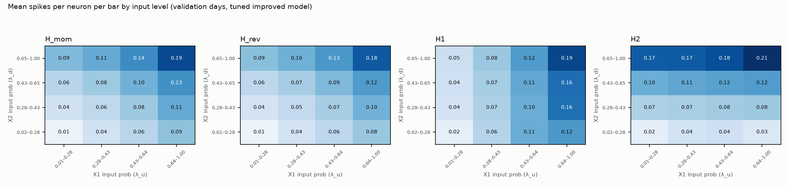
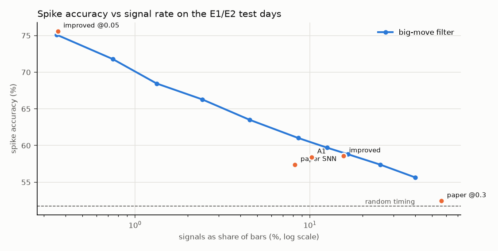

# Premise checks for a momentum/reversion model (U10, Phase A)

100 aggTrades per bar. A1–A3: validation days 2025-10-17 → 2025-11-30 (45 days), W_h = 1,
W_snn = 1, seed 0 — these inform the design. A4: the existing E1/E2 test results (seed 0 signals),
for the critique only. Runtime 22 s. Raw data: `results/typed_premise_checks/`.

**Trade label** at bar t (paper execution): dir_t = MomentumRule(3) direction,
follow_ret_t = dir_t · (vwap[t+4] / vwap[t+1] − 1); *momentum* = following wins (> 0),
*reversion* = fading wins (< 0); bars with dir_t = 0, no exit bar or a zero return are excluded.
**Paper label**: mom_rev_flag (§8.4), momentum ⇔ flag ≤ 0.

## Gate

- Best Hawkes feature AUC on the trade label, in its expected direction: **0.504**, M (quantile 0.95) (rule: ≥ 0.53).
- Features clearly in the opposite direction (AUC below 0.47 in the expected orientation): none.
- Fading has a positive mean return in at least one M decile: **yes**.
- Suggested rule **not passed**.

## A1 — Hawkes teacher check (at Hawkes event bars)

AUC > 0.5 means the feature is higher for momentum. For p_cross the expected direction is
reversed (higher for reversion), so its AUC should lie below 0.5.

| event quantile | events per day | reversion share (trade label) | M: trade | M: paper | p_same: trade | p_same: paper | p_cross: trade | p_cross: paper | λ asymmetry: trade | λ asymmetry: paper |
|---|---|---|---|---|---|---|---|---|---|---|
| 0.8 | 4,103 | 0.471 | 0.503 | 0.501 | 0.503 | 0.499 | 0.496 | 0.495 | 0.502 | 0.502 |
| 0.9 | 2,113 | 0.474 | 0.502 | 0.497 | 0.501 | 0.495 | 0.499 | 0.501 | 0.498 | 0.496 |
| 0.95 | 1,104 | 0.477 | 0.504 | 0.499 | 0.503 | 0.496 | 0.497 | 0.500 | 0.496 | 0.493 |

Reversion base rate under the trade label over all decided bars:
q = 0.8: 0.480
(paper label: 0.426).

### M deciles, event quantile 0.8

| M decile | events | M range | P(follow wins) | follow bp | fade bp |
|---|---|---|---|---|---|
| 1 | 18458 | -0.94 … -0.69 | 0.530 | +0.155 | -0.155 |
| 2 | 18458 | -0.69 … -0.57 | 0.523 | +0.143 | -0.143 |
| 3 | 18457 | -0.57 … -0.28 | 0.523 | +0.104 | -0.104 |
| 4 | 18458 | -0.28 … -0.07 | 0.523 | +0.147 | -0.147 |
| 5 | 18457 | -0.07 … +0.08 | 0.529 | +0.158 | -0.158 |
| 6 | 18458 | +0.08 … +0.37 | 0.530 | +0.167 | -0.167 |
| 7 | 18457 | +0.37 … +0.50 | 0.528 | +0.164 | -0.164 |
| 8 | 18458 | +0.50 … +0.59 | 0.537 | +0.182 | -0.182 |
| 9 | 18457 | +0.59 … +0.68 | 0.536 | +0.182 | -0.182 |
| 10 | 18458 | +0.68 … +0.96 | 0.528 | +0.076 | -0.076 |

### M deciles, event quantile 0.9

| M decile | events | M range | P(follow wins) | follow bp | fade bp |
|---|---|---|---|---|---|
| 1 | 9507 | -0.97 … -0.76 | 0.520 | +0.055 | -0.055 |
| 2 | 9506 | -0.76 … -0.65 | 0.521 | +0.121 | -0.121 |
| 3 | 9506 | -0.65 … -0.54 | 0.532 | +0.173 | -0.173 |
| 4 | 9506 | -0.54 … -0.33 | 0.531 | +0.132 | -0.132 |
| 5 | 9506 | -0.33 … -0.04 | 0.521 | +0.111 | -0.111 |
| 6 | 9506 | -0.04 … +0.08 | 0.525 | +0.083 | -0.083 |
| 7 | 9506 | +0.08 … +0.27 | 0.529 | +0.126 | -0.126 |
| 8 | 9506 | +0.27 … +0.48 | 0.527 | +0.100 | -0.100 |
| 9 | 9506 | +0.48 … +0.65 | 0.526 | +0.150 | -0.150 |
| 10 | 9506 | +0.65 … +0.96 | 0.530 | +0.112 | -0.112 |

### M deciles, event quantile 0.95

| M decile | events | M range | P(follow wins) | follow bp | fade bp |
|---|---|---|---|---|---|
| 1 | 4969 | -0.98 … -0.81 | 0.520 | -0.075 | +0.075 |
| 2 | 4968 | -0.81 … -0.67 | 0.524 | +0.116 | -0.116 |
| 3 | 4968 | -0.67 … -0.55 | 0.511 | +0.035 | -0.035 |
| 4 | 4968 | -0.55 … -0.35 | 0.522 | +0.138 | -0.138 |
| 5 | 4968 | -0.35 … -0.11 | 0.521 | +0.082 | -0.082 |
| 6 | 4968 | -0.11 … +0.08 | 0.522 | +0.013 | -0.013 |
| 7 | 4968 | +0.08 … +0.27 | 0.522 | +0.093 | -0.093 |
| 8 | 4968 | +0.27 … +0.46 | 0.535 | +0.169 | -0.169 |
| 9 | 4968 | +0.46 … +0.67 | 0.530 | +0.129 | -0.129 |
| 10 | 4968 | +0.67 … +0.95 | 0.522 | +0.046 | -0.046 |

## A1b — is the trade label predictable from causal inputs at all?

The typed network would see λ_u, λ_d (Hawkes intensities at t⁺) and, through them, recent moves.
Logistic regression of "following wins" on features oriented by the trade direction dir_t: signed
moves and move sizes at t, t−1, t−2, the intensity asymmetry at t, t−1, t−2 and the log total
intensity (all bars with a decided trade label, event quantile 0.9). Fitted on the first half of
the validation days, evaluated on the second half. An AUC near 0.5 means no causal feature set of
this kind separates momentum from reversion, whatever teacher trains the network.

| sample | AUC | bars |
|---|---|---|
| fit half (first 22 days) | 0.516 | 398,339 |
| held-out half (last 23 days) | 0.512 | 493,972 |

Single features:

| feature | AUC (all days) |
|---|---|
| move_0 | 0.512 |
| size_0 | 0.510 |
| asym_0 | 0.497 |
| move_1 | 0.497 |
| size_1 | 0.499 |
| asym_1 | 0.497 |
| move_2 | 0.501 |
| size_2 | 0.499 |
| asym_2 | 0.497 |
| log_lam_total | 0.501 |

Value of typing (fee-free, paper execution): how much a typed strategy could earn over always
following if its type came from this classifier, compared with a perfect (non-causal) type.

| momentum strategy, held-out validation bars | bp per trade | trades faded |
|---|---|---|
| always follow (untyped) | +0.087 | 0 % |
| fade when the classifier says reversion (p < 0.5) | +0.090 | 4% |
| fade the 10 % most reversion-like bars | +0.096 | 10 % |
| oracle: true type known (not causal, upper bound) | +2.524 | 48% |

## A2 — pool check (tuned improved model, validation folds)

D = spikes(H_mom) − spikes(H_rev) summed over the last τ_z bars (τ_z = 1 bar for the tuned model).

| where | AUC vs trade label | AUC vs paper label | n | AUC vs sign(M) | Spearman(D, M) |
|---|---|---|---|---|---|
| at output signals | 0.499 | 0.499 | 144,267 |  |  |
| at all bars | 0.501 | 0.501 | 892,626 |  |  |
| at Hawkes events |  |  | 49,687 | 0.505 | 0.007 |

Mean spikes per neuron per bar by input level (rows: X2 = λ_d-encoded input, columns: X1 = λ_u-encoded input):

| H_mom: X2 \ X1 | 0.01–0.28 | 0.28–0.43 | 0.43–0.64 | 0.64–1.00 |
|---|---|---|---|---|
| 0.02–0.28 | 0.012 | 0.040 | 0.061 | 0.086 |
| 0.28–0.43 | 0.041 | 0.057 | 0.079 | 0.108 |
| 0.43–0.65 | 0.061 | 0.078 | 0.100 | 0.131 |
| 0.65–1.00 | 0.093 | 0.107 | 0.135 | 0.188 |

| H_rev: X2 \ X1 | 0.01–0.28 | 0.28–0.43 | 0.43–0.64 | 0.64–1.00 |
|---|---|---|---|---|
| 0.02–0.28 | 0.011 | 0.038 | 0.057 | 0.081 |
| 0.28–0.43 | 0.038 | 0.054 | 0.073 | 0.101 |
| 0.43–0.65 | 0.058 | 0.073 | 0.094 | 0.122 |
| 0.65–1.00 | 0.088 | 0.102 | 0.125 | 0.176 |

| H1: X2 \ X1 | 0.01–0.28 | 0.28–0.43 | 0.43–0.64 | 0.64–1.00 |
|---|---|---|---|---|
| 0.02–0.28 | 0.019 | 0.063 | 0.105 | 0.125 |
| 0.28–0.43 | 0.038 | 0.068 | 0.105 | 0.157 |
| 0.43–0.65 | 0.042 | 0.073 | 0.111 | 0.159 |
| 0.65–1.00 | 0.045 | 0.080 | 0.122 | 0.190 |

| H2: X2 \ X1 | 0.01–0.28 | 0.28–0.43 | 0.43–0.64 | 0.64–1.00 |
|---|---|---|---|---|
| 0.02–0.28 | 0.019 | 0.039 | 0.042 | 0.030 |
| 0.28–0.43 | 0.068 | 0.071 | 0.075 | 0.079 |
| 0.43–0.65 | 0.104 | 0.112 | 0.116 | 0.120 |
| 0.65–1.00 | 0.173 | 0.174 | 0.184 | 0.209 |

## A3 — firing rate during learning vs with the final weights

Each training day re-simulated with the final (frozen) weights and the same input spikes.

| model | rate_learning | rate_frozen | rate_test | acc_learning | acc_frozen | acc_test |
|---|---|---|---|---|---|---|
| improved | 0.1102 | 0.1327 | 0.1654 | 0.5666 | 0.5554 | 0.5540 |
| paper | 0.0585 | 0.0959 | 0.0957 | 0.5756 | 0.5340 | 0.5343 |

## A4 — critique on the E1/E2 test results (not used for design)

### Bars since the last big move (|d| above the training day's 0.9 quantile)

| signals | bars since big move | share | real-spike rate | bp per trade |
|---|---|---|---|---|
| paper SNN | 0 | 0.264 | 0.621 | 0.044 |
| paper SNN | 1 | 0.205 | 0.577 | 0.070 |
| paper SNN | 2 | 0.065 | 0.566 | 0.067 |
| paper SNN | 3–5 | 0.126 | 0.547 | 0.073 |
| paper SNN | >5 | 0.341 | 0.496 | 0.089 |
| improved | 0 | 0.165 | 0.634 | 0.087 |
| improved | 1 | 0.136 | 0.609 | 0.046 |
| improved | 2 | 0.106 | 0.592 | 0.036 |
| improved | 3–5 | 0.212 | 0.571 | 0.065 |
| improved | >5 | 0.381 | 0.506 | 0.065 |
| big-move at paper SNN's rate | 0 | 0.922 | 0.588 | 0.093 |
| big-move at paper SNN's rate | 1 | 0.013 | 0.605 | 0.097 |
| big-move at paper SNN's rate | 2 | 0.011 | 0.572 | 0.120 |
| big-move at paper SNN's rate | 3–5 | 0.021 | 0.551 | 0.120 |
| big-move at paper SNN's rate | >5 | 0.032 | 0.489 | 0.140 |
| big-move at improved's rate | 0 | 0.550 | 0.589 | 0.094 |
| big-move at improved's rate | 1 | 0.066 | 0.593 | 0.081 |
| big-move at improved's rate | 2 | 0.056 | 0.566 | 0.096 |
| big-move at improved's rate | 3–5 | 0.112 | 0.548 | 0.120 |
| big-move at improved's rate | >5 | 0.216 | 0.484 | 0.148 |

### Autocorrelation by lag (100 trades per bar)

| lag (bars) | autocorr sign(d) | autocorr |d| |
|---|---|---|
| 1 | 0.247 | 0.053 |
| 2 | 0.060 | 0.087 |
| 3 | 0.023 | 0.080 |
| 5 | 0.007 | 0.073 |
| 10 | 0.004 | 0.062 |
| 20 | 0.002 | 0.053 |
| 50 | -0.000 | 0.042 |

### Accuracy within |d_t| deciles (a signal adds information if it beats "all bars" in its own decile)

| |d_t| decile | accuracy: all bars | accuracy: improved | accuracy: paper SNN | share of signals: improved | share of signals: paper SNN |
|---|---|---|---|---|---|
| 1 | 0.479 | 0.530 | 0.522 | 0.093 | 0.035 |
| 2 | 0.485 | 0.537 | 0.521 | 0.093 | 0.040 |
| 3 | 0.489 | 0.540 | 0.515 | 0.094 | 0.049 |
| 4 | 0.490 | 0.541 | 0.517 | 0.094 | 0.060 |
| 5 | 0.494 | 0.544 | 0.518 | 0.094 | 0.075 |
| 6 | 0.501 | 0.548 | 0.515 | 0.095 | 0.092 |
| 7 | 0.514 | 0.558 | 0.536 | 0.097 | 0.113 |
| 8 | 0.528 | 0.571 | 0.546 | 0.100 | 0.137 |
| 9 | 0.545 | 0.590 | 0.562 | 0.107 | 0.161 |
| 10 | 0.591 | 0.645 | 0.627 | 0.133 | 0.238 |

### Logistic regression of the real-spike label (every 5th test day, evaluable bars)

Baseline features: log(1 + |d_t|/s), log(1 + |d_t−1|/s), log(1 + |d_t−2|/s), log(1 + 20-bar mean |d|/s), s = training-day
median |d|. The signal indicator is added on top; a positive, significant coefficient means the signal
carries information beyond these features.

| model | signal coefficient | std. error | z | LR statistic | AUC without → with signal |
|---|---|---|---|---|---|
| paper SNN | +0.0371 | 0.0074 | +5.0 | 25.4 | 0.5802 → 0.5802 |
| improved | +0.0878 | 0.0059 | +14.8 | 219.1 | 0.5802 → 0.5807 |

### Accuracy vs signal rate

| target rate | realised rate | big-move accuracy |
|---|---|---|
| 0.002 | 0.0036 | 0.7512 |
| 0.005 | 0.0075 | 0.7179 |
| 0.01 | 0.0133 | 0.6846 |
| 0.02 | 0.0242 | 0.6630 |
| 0.04 | 0.0451 | 0.6352 |
| 0.08 | 0.0857 | 0.6102 |
| 0.12 | 0.1255 | 0.5970 |
| 0.16 | 0.1649 | 0.5881 |
| 0.25 | 0.2528 | 0.5739 |
| 0.4 | 0.3997 | 0.5565 |

